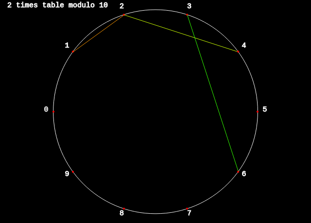
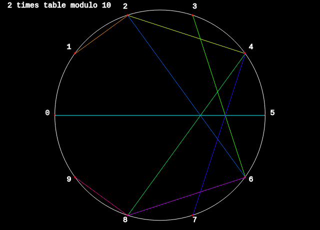
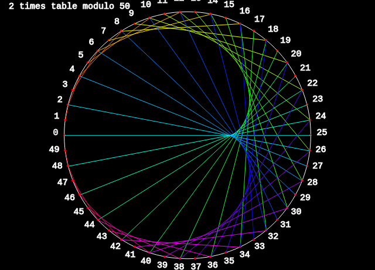

# Times Tables

Times tables are constructed by dividing a circle into `n` equal parts, then using lines to connect points that are related by a times table. This is best understood by example:

In this example, the circle is divided into 10 equal parts, this is called the `modulo` and we are using the `2 times table`.

    2 x 0 = 0, so we don't draw any lines
    2 x 1 = 2, so we connect 1 and 2
    2 x 2 = 4, so we connect 2 and 4
    2 x 3 = 6, so we connect 3 and 6
    ... and so on

After we have completed a full turn, we have connected every possible point with its corresponding one.

You can change the `modulo` to divide the circle in more parts and, if you do so, a pattern emerges:

The sketch allows you to play with both the `modulo` and the `n times table` parameter.

## Resources

This sketch was inspired by the Mathologer video [Times Tables, Mandelbrot and the Heart of Mathematics](https://www.youtube.com/watch?v=qhbuKbxJsk8). Be sure to check this video for a detailed explanation of this.
