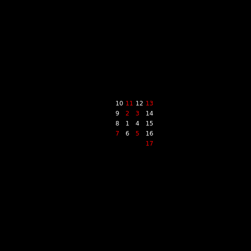
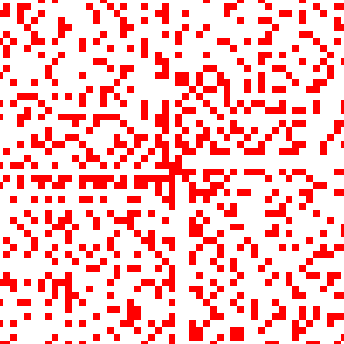
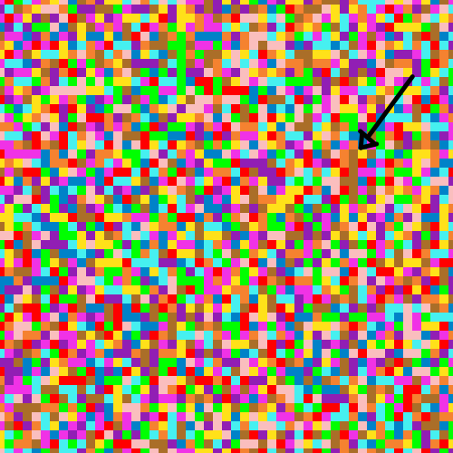

# Ulam Spiral

An Ulam spiral is a mathematical construction where one draws numbers in a spiral and marking the numbers that are prime. 

Primes seem to line up in diagonals. One could reasonably deduce that odd numbers will always line up in diagonals and this is why primes, which cannot be even except for the number 2 itself, will always appear in these diagonals.

For this reason, the sketch also has another mode in which only odd numbers are drawn, resulting in another pattern.

The sketch also has other modes which draw the digits from a few famous mathematical constants, like `e`, `pi`, `the square root of 2` and `phi`. The construction is the same, the digits are arranged in a spiral and colored depending on the digit being drawn.

In the example below, `pi` is drawn in a spiral, with the [Feynman point](https://en.wikipedia.org/wiki/Six_nines_in_pi) labeled with an arrow.

## Resources

This sketch was inspired by the [Prime Spirals](https://www.youtube.com/watch?v=iFuR97YcSLM) video on the Numberphile Youtube channel.

You can also read more about Ulam spirals in its [Wikipedia article](https://en.wikipedia.org/wiki/Ulam_spiral).